# How does CSS work behind the scene?
> &#9888; These are my notes on how CSS works behind the scene. If you find
them helpful, great fork it, copy it whatever but don't fully rely on it because
some info may not be complete or explained clearly. These are NOT official docs!

## Alright, Lets Start
Before we move on with how CSS works there are some thing to keep in mind while
designing a website. Keeping these things in mind will help you understand why
you need to know about the behind the scene and vice versa.

The important pillars of a modern web design are:
* Responsive Design
* Maintainable and scalable code
* Performance

### Responsive Design
Responsive design is the modern standard. Every modern website is responsive
and there is a good reason for it. Many people visit websites on smart phones
and websites have to adapt. Following are the fundamentals of a responsive
design:
* Fluid layouts
* Media queries
* Responsive images
* Correct units
* Desktop-first or mobile-first approach

### Maintainable and Scalable Code
You should write your code in a way so it can be easily read, maintained and
scaled also your code should be reusable. To write maintainable and scalable
code your code should have following characteristics:
* Clean
* Easy to understand
* Easy to grow
* Reusable
* Organisable
* Correct naming - understandable classes names
* Good HTML structure

### Performance
Performance is very important. Nobody wants to wait for a website to load
especially when they are on a smart phone. Fundamentals of making a website
faster:
* Less HTTP request
* Less code
* Compress your code
* Use a CSS preprocessors
* Less images
* Compress images


## What Happens to CSS When a Page is Loaded
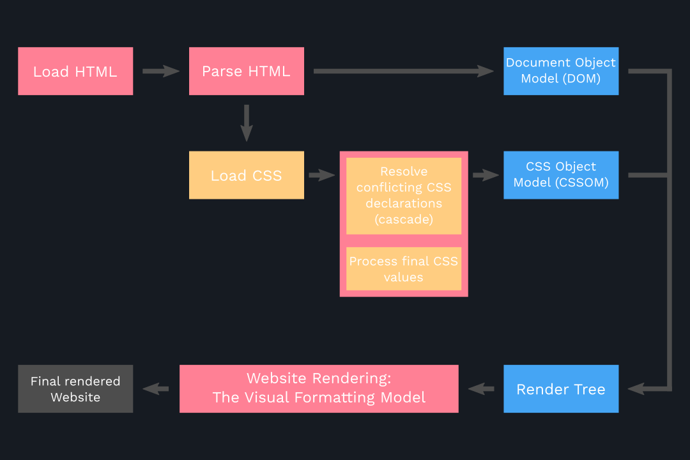

## How is CSS Parsed - Cascade and Specificity
### Terminology
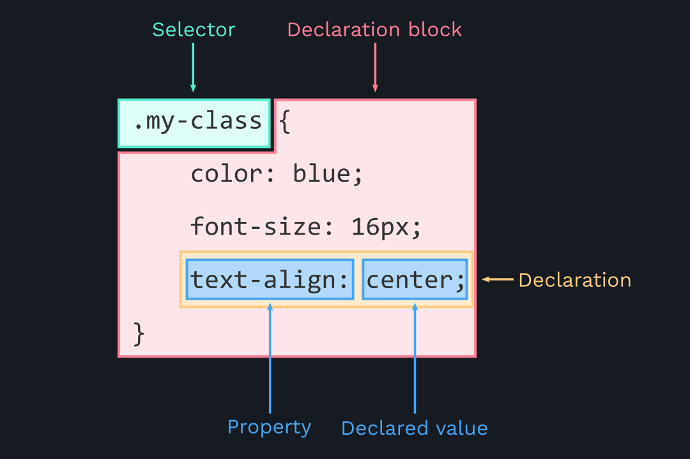

### The Cascade
The Cascade is an algorithm that defines how to combine property values
originating from different sources. It lies at the core of CSS, as emphasized
by the name: *Cascading Style Sheets*. [Source](https://developer.mozilla.org/en-US/docs/Web/CSS/Cascade)

Basically the Cascade combines different stylesheets and resolves conflicts
between different CSS rules and declarations when more than one rule applies to
a certain element. It simply selects CSS declarations and determines correct
values for CSS properties. CSS declarations originates from different
origins/sources:
* Author stylesheets -> Declared by the designer, the code you write. The most
    common type style sheet.
* User stylesheets -> The user (or reader) of the website can choose to
    override styles through browser.
* User-agent stylesheets -> The browser has a basic style sheet that gives a
    default style to any document.

In order to resolve conflicts the Cascade looks at importance (`!important`),
selectors specificity, and source order of conflicting declarations.

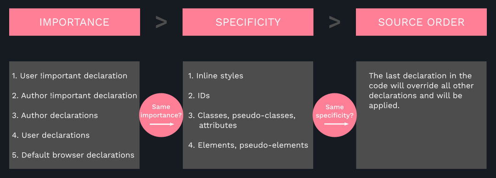

> If the importance was the same for all selectors the Cascade will look at
specificity to apply the styles of the most specific selectors. If all the
selectors had the same specificity then it will look at source order and apply
the last declared styles.

#### Examples
#### Importance
```css
.button {
    color: #fff;
    font-size: 16px;
    background-color: #333 !important;
}

#nav .button {
    background-color: #999;
}
/* #333 will be applied NOT #999 */
```

#### Specificity
```css
.button {
    color: #fff;
    font-size: 16px;
    background-color: #333;
}                               /* (inline, IDs, Classes, Elements) */
                                /* (  0   ,  0 ,    1   ,    0    ) */

nav#nav div.pull-right .button {
    background-color: #999;
}                               /* (inline, IDs, Classes, Elements) */
                                /* (  0   ,  1 ,    2   ,    2    ) */

a {
    background-color: #666;
}                               /* (inline, IDs, Classes, Elements) */
                                /* (  0   ,  0 ,    0   ,    1    ) */

/* :hover is pseudo-class therefore it counts as a class*/
#nav a.button:hover {
    background-color: #999;
}                               /* (inline, IDs, Classes, Elements) */
                                /* (  0   ,  1 ,    2   ,    1    ) */
```
Now to determine the specificity we first look at inline styles if there are
any. For all the above cases there are no inline styles therefore it's 0 for
all. Then we look IDs if there are any. Then we look at classes and lastly the
elements. In the example above `(0, 0, 1, 0)` and `(0, 0, 0, 1)` can be
thrown out because they're the least specific. But `(0, 1, 2, 1)` and
`(0, 1, 2, 2)` are the ones to look at. So `(0, 1, 2, 1)` has one ID,
two classes and one element which makes it very specific but `(0, 1, 2, 2)`
has one ID, two classes and 2 elements which is the most specific one.
Therefore the styles of the second selector will be applied and other styles will
be ignored.

If the specificity from all the selectors was the same then 'source order' rule
will be applied. Which means the last declared styles will be applied.

```css
nav#nav div.pull-right .button {
    background-color: #666;
}                               /* (inline, IDs, Classes, Elements) */
                                /* (  0   ,  1 ,    2   ,    2    ) */

#nav a.button:hover {
    background-color: #999;
}                               /* (inline, IDs, Classes, Elements) */
                                /* (  0   ,  1 ,    2   ,    1    ) */

/* 
hover will not work because it's specificity is lower than the selector
above. To make the hover work we will have to use the same specificity like so:
*/
nav#nav div.pull-right .button:hover {
    background-color: #999;
}
```

##### Key takeaways:
* CSS declarations marked with `!important` have the highest priority.
* But using `!important` is bad practice. It's better to rely on specificities
    than to just use `!important`. The code should be maintainable!
* Inline styles will always have priority over styles in external stylesheets.
* A selector that contains 1 ID is more specific than one with 1000 classes.
* A selector that contains 1 class is more specific than one with 1000 element selectors.
* The universal selector `*` has no specificity value `(0, 0, 0, 0)`.
* Rely more on specificity than on the order of selectors.
* But, use source order when working with 3rd-party styles -- always put author
    stylesheets last.

### How CSS Values are Processed
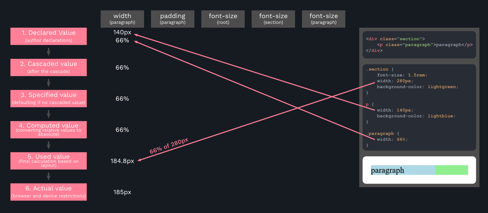
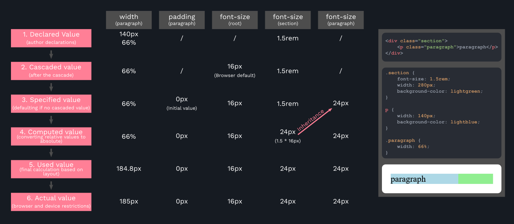

### How Units are Converted From Relative to Absolute (Pixels)
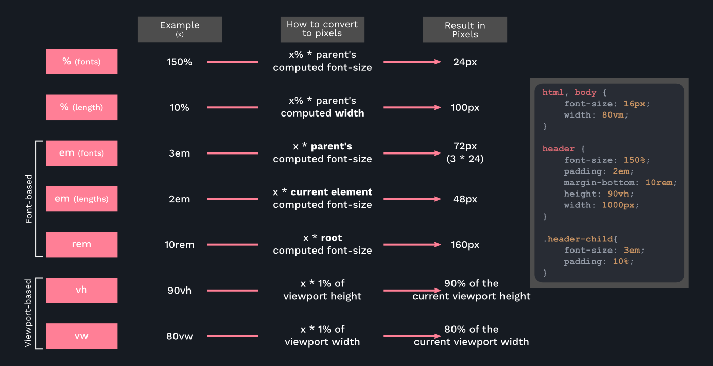

##### Key takeaways:
* Each property has an initial value, used if no specific value is declared
    (and if there is no inheritance).
* Browsers specify a root font-size for each page (usually 16px).
* Percentages and relative values always converted to pixels.
* Percentages are measured relative to their parent's font-size, if used to
    specify font-size.
* Percentages are measured relative to their parent's width, if used to specify
    lengths.
* em are measured relative to their parent font-size, if used to specify
    font-size.
* em are measured relative to the current font-size, if used to specify
    lengths.
* rem are always measured relative to the document's root font-size.
* vh and vw are simply percentage measurements of the viewport's height and
    width.

### Inheritance in CSS
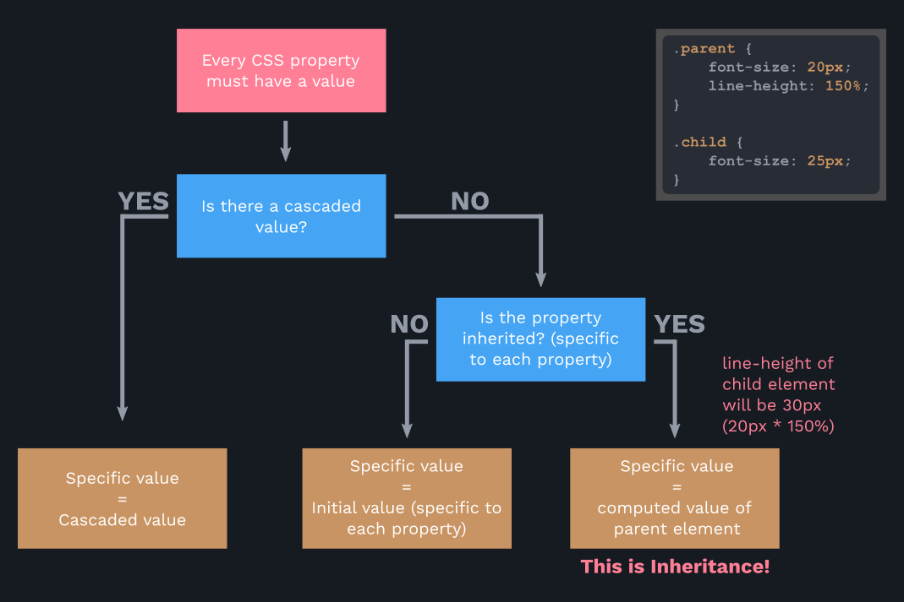

##### Key takeaways:
* Inheritance passes the values for some specific properties from parents to
    children. Should be used to write maintainable code.
* Properties related to text are inherited: `font-family`, `font-size`, `color` etc.
* Computed values of a property are inherited, NOT the declared value.
* Inheritance of a property only works if no value is declared for that
    property.
* The `initial` keyword resets a property to its initial value.
* The `inherit` keyword forces inheritance on a certain property. Example:
    ```css
    * {
        margin: 0;
        padding: 0;
        box-sizing: inherit; /* Will be inherited from body */
    }

    body {
        box-sizing: border-box;
    }
    ```

## Now it's Time to Use What We've Learned
The most important thing for us to do is to write our CSS in a way that is
clean, maintainable and scalable -- somewhat dynamic. To achieve that we have
to use relative units to avoid writing lots of CSS. Repetitively using same
selectors with different properties and value declarations leads to messy and
unstable code. Also if we don't use correct units then it'll lead to using
unnecessary media queries, thus messy and unmaintainable code. Correct units
are crucial to responsive design.

To make things easy we'll use `rem` units. Which means relative to the
root. The root `font-size` is set in the `html` selector. We will use
font size to be `10px` instead of `16px`. It'll make things super easy
for us. What root font size `10px` means is that `1rem = 10px`. Because
10 is a round number what we can do is to divide each pixels values by `10px`
and it'll give us nice rounded `rem` values e.g `16px / 10px = 1.6rem`.

#### Example
```css
html {
    font-size: 10px;
}

body {
    padding: 3rem; /* 30px / 10px = 3rem */
}

.logo-box {
    position: absolute;
    top: 4rem; /* 40px / 10px = 4rem */
    left: 4rem; /* 40px / 10px = 4rem */
}

.logo {
    height: 3.5rem;  /* 35px / 10px = 3.5rem */
}

.heading-primary {
    margin-bottom: 6rem; /* 60px / 10px = 6rem */
}

.heading-primary-main {
    font-weight: 400;
    font-size: 6rem; /* 60px / 10px = 6rem */
    letter-spacing: 3.5rem;  /* 35px / 10px = 3.5rem */
}

.heading-primary-sub {
    font-weight: 700;
    font-size: 2rem; /* 20px / 10px = 2rem */
    letter-spacing: 1.75rem;  /* 17.5px / 10px = 1.75rem */
}

.button {
    padding: 1.5rem 4rem; /* 15px / 10 = 1.5rem - 40px / 10px = 4rem */
}
```

As you can see we can declare everything in `rem` relative to the root
`font-size`. If we want to make them bigger or smaller the only thing we
have to do is to change the root `font-size` and that's it. We don't have
to write thousands of media queries, change every value by hand pixel by pixel,
rewrite each selector and redeclare values. `rem` makes our lives easier.

BUT there is still one problem and that is our `font-size` is set to
`10px` which is an absolute value. That means is that our values are still
relative to an absolute value. If you've heard of "Web Accessibility" we are
excluding people with disabilities with our `font-size` set to `10px`
which is a poor design choice. If there's someone with limited eyesight and
want to change the default font size of the browser or zoom-in or out then
they'll not be able to do that.

> Web accessibility means that websites, tools, and technologies are designed and
developed so that people with disabilities can use them. More specifically,
people can: perceive, understand, navigate, and interact with the Web.
[Source](https://www.w3.org/WAI/fundamentals/accessibility-intro/)

#### Solution
We can set the `font-size` to percentage. `100%` would mean `16px` as it's default.
But we want our `font-size` to be `10px`. That can be easily calculated.
`10/16 = 0.625 * 100 = 62.5%`. So we set our root font size to be 62.5%.<br/>
Now when the user changes the default font size of the browser to for example
16px that would be `0.625*16 = 10px` likewise 20px would be `0.625*20 = 12.5px` so
it will change accordingly and our website will be accessible to everyone.

## The Visual Formatting Model
> The *CSS visual formatting model* is an algorithm that processes a document and
displays it on visual media. This model is a basic concept of CSS. The visual
formatting model transforms each element of the document and generates zero, one,
or several boxes that conform to the CSS box model. The layout of each box is
defined by:
> * The dimensions of the box: precisely defined or constrained, or not
> * The type of box: inline, inline-level, atomic inline-level, block
> * The positioning scheme: in the normal flow, a float, or absolute positioning
> * The other elements in the tree: its children or neighbors
> * The viewport size and position
> * Intrinsic dimensions of contained images
> * Other external information
>
>The model renders a box in relation to the edge of its containing block. Usually,
a box establishes the containing block for its descendants. However, a box is not
constrained by its containing block; when a box's layout goes outside the containing
block, it is said to overflow. [Source](http://man.hubwiz.com/docset/CSS.docset/Contents/Resources/Documents/developer.mozilla.org/en-US/docs/Web/Guide/CSS/Visual_formatting_model.html)

To understand what *Containing Block* is and how it's determined read [this
article](https://developer.mozilla.org/en-US/docs/Web/CSS/Containing_block).

So basically the visual formatting model algorithm calculates boxes and
determines the layout of these boxes, for each element in the render tree
(divs, paragraphs, images etc), in order to determine the final layout
of the page. Every element is represented by a box on the page. So the whole
layout/ the fully rendered page is made up of boxes. When a box is generated
each box is divided into four areas:
1. Content area
2. Padding area
3. Border area
4. Margin area

### The Box Model
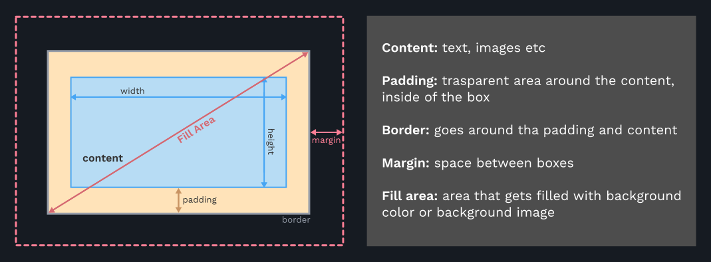

#### The Box Model: Width and Height
```
Total width = right border + right padding + specified width + left padding +
left border

Total height = top border + top padding + specified height + bottom padding +
bottom border

Example: height = 0 + 20px + 100px + 20px + 0 = 140px
```
#### The Box Model: `box-sizing: border-box;`
When we set `box-sizing` to `border-box` the height and width will be declared
for the entire box including padding and the border, not just for the content
area. In other words the border and padding will not be added to the total
width and total height but rather reduced to declared width and height.

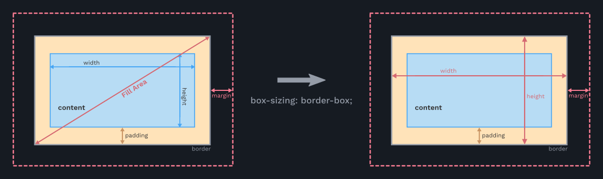

Total width = ~~right border~~ + ~~right padding~~ + specified width + ~~left padding~~ +
~~left border~~

Total height = ~~top border~~ + ~~top padding~~ + specified height + ~~bottom padding~~ +
~~bottom border~~

Example: height = ~~0~~ + ~~20px~~ + 100px + ~~20px~~ + ~~0~~ = 100px

As you can see in the above example the total height is not `140px` but
rather `100px` because padding is not added to the height but reduced in order
to be included in the height.

#### The Box Model: Box Types
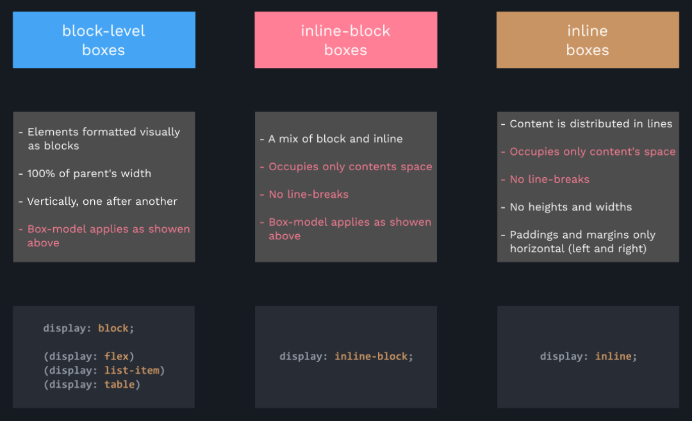

#### The Box Model: Positioning Scheme
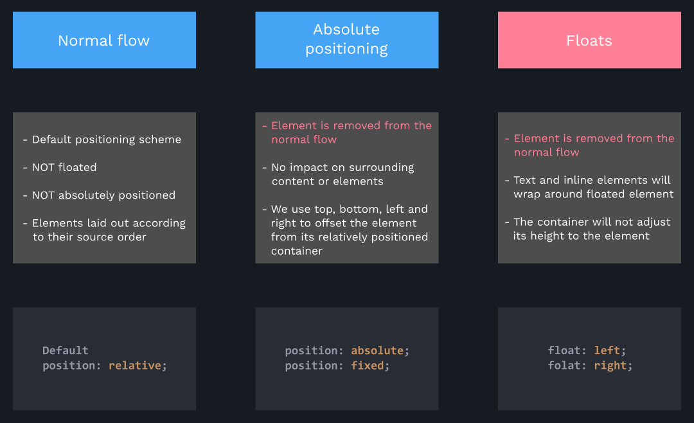

### Stacking Context
Stacking context determines in which order elements are rendered on the page.
Stacking context can be created by various properties but the most common
property is `z-index`. Stacking context are simply layers bottom layers are
painted first and other appear on top of each other. Elements with lower
`z-index` appear at the bottom and elements with higher `z-index`appear on the
top.
```
_______________ -> z-index: 3; position: relative;

_______________ -> z-index: 2; position: absolute;

_______________ -> z-index: 1; position: relative;
```
Not only `z-index` creates stacking context but also `opacity` of values different
from one another, `transforms` and `filters` also create stacking context.

## CSS (SASS) Architecture
### The 7-1 Pattern
```
sass/
|
|– base/
|   |– _reset.scss       # Reset/normalize
|   |– _typography.scss  # Typography rules
|   ...                  # Etc…
|
|– components/
|   |– _buttons.scss     # Buttons
|   |– _carousel.scss    # Carousel
|   |– _cover.scss       # Cover
|   |– _dropdown.scss    # Dropdown
|   ...                  # Etc…
|
|– layout/
|   |– _navigation.scss  # Navigation
|   |– _grid.scss        # Grid system
|   |– _header.scss      # Header
|   |– _footer.scss      # Footer
|   |– _sidebar.scss     # Sidebar
|   |– _forms.scss       # Forms
|   ...                  # Etc…
|
|– pages/
|   |– _home.scss        # Home specific styles
|   |– _contact.scss     # Contact specific styles
|   ...                  # Etc…
|
|– themes/
|   |– _theme.scss       # Default theme
|   |– _admin.scss       # Admin theme
|   ...                  # Etc…
|
|– abstracts/
|   |– _variables.scss   # Sass Variables
|   |– _functions.scss   # Sass Functions
|   |– _mixins.scss      # Sass Mixins
|   |– _helpers.scss     # Class & placeholders helpers
|
|– vendors/
|   |– _bootstrap.scss   # Bootstrap
|   |– _jquery-ui.scss   # jQuery UI
|   ...                  # Etc…
|
|
`– main.scss             # Main Sass file
```
[Source](https://gist.github.com/rveitch/84cea9650092119527bc)
